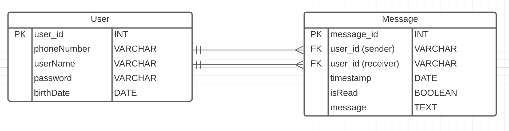

# MessagingApp_API

## Description
Backend of Messaging App (<https://messaging--app.herokuapp.com/>).

This API stores and created Users and Messages sent and received in the app.

## User Stories
- As a user, I want to register a new user.
- As a user, I want to authenticate my account with my credentials.
- As a user, I want to get all my messages.
- As a user, I want to get all users username and phone numbers.
- As a user, I want to get all messages shared between me and other users.
- As a user, I want to update the status of a message (if it has been read or not).
- As a user, I want to delete a message.
- As a user, I want to see all the messages I've sent to another user by user Id.
- As a user, I want to see all the messages I've received from another user by Id.

## Endpoints

| Request Type | URL                               | Functionality                                                    |
|--------------|-----------------------------------|------------------------------------------------------------------|
| POST         | /auth/users/register              | Registers a new user                                             |
| POST         | /auth/users/login                 | Logs a user in                                                   |
| GET          | /api/users                        | Get all users information                                        |
| GET          | /api/user                         | Get logged in user information                                   |
| GET          | /api/messages                     | Get all user messages                                            |
| GET          | /api/messages/shared              | Get all shared messages between main user and another User by ID |
| GET          | /api/messages/sent/{receiverId}   | Get all messages user sent to another specific user              |
| POST         | /api/messages/received/{senderId} | Get all messages user received from another specific user        |
| PUT          | /api/messages/{messageId}         | Updates message status                                           |
| DEL          | /api/messages/{messageId}         | Deletes message                                                  |

## ER diagram
